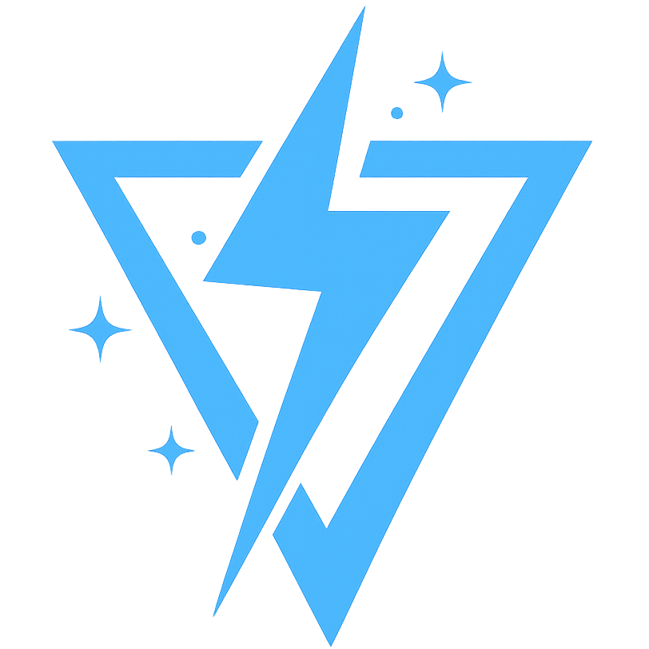
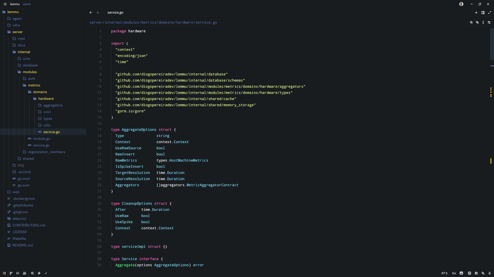

<div align="center">
  
  <br />
  <br />
  <div>
    
    
    
  </div>
  <hr />
</div>

A **modern and minimalistic dark theme** for the **Zed editor**, focused on visual comfort, balanced contrast, and a color palette inspired by **Dracula**, with its own strong identity.

## Features

* Elegant dark color palette with vibrant accents
* Comfortable for long coding sessions
* Clear and consistent syntax highlighting
* Clean interface with minimal visual noise
* Fully compatible with the official Zed theme schema

## Preview
<p align="center">
  
</p>

## Installation

### Zed Extensions (recommended)

1. Open **Zed**
2. Go to **Extensions**
3. Search for **Zord Theme**
4. Install and activate it

### Manual Installation

1. Clone the repository:

```bash
git clone https://github.com/diogopereiradev/zord-theme.git
```

2. Copy the project into Zed's extensions directory
3. Restart the editor
4. Select **Zord Theme – Dark** from the theme list

## Color Palette

The theme is built on a dark bluish background with accent colors inspired by Dracula. These colors are applied consistently across:

* Syntax highlighting
* Multiple cursors
* Editor UI states (error, warning, success, info)
* Panels and controls

## Syntax Highlighting

**Zord Theme** provides:

* Strong keyword emphasis
* Soft, readable strings
* Subtle comments
* Italicized types and interfaces
* Distinct styling for parameters and enums

## Development

Contributions are welcome. Feel free to open issues or pull requests for:

* Color tweaks
* Contrast improvements
* Syntax refinements

## License

This project is licensed under the **MIT License**. See the [LICENSE](./LICENSE) file for details.

## Author

**Diogo Pereira**

* GitHub: [https://github.com/diogopereiradev](https://github.com/diogopereiradev)
* Website: [https://diogopereira.dev](https://diogopereira.dev)